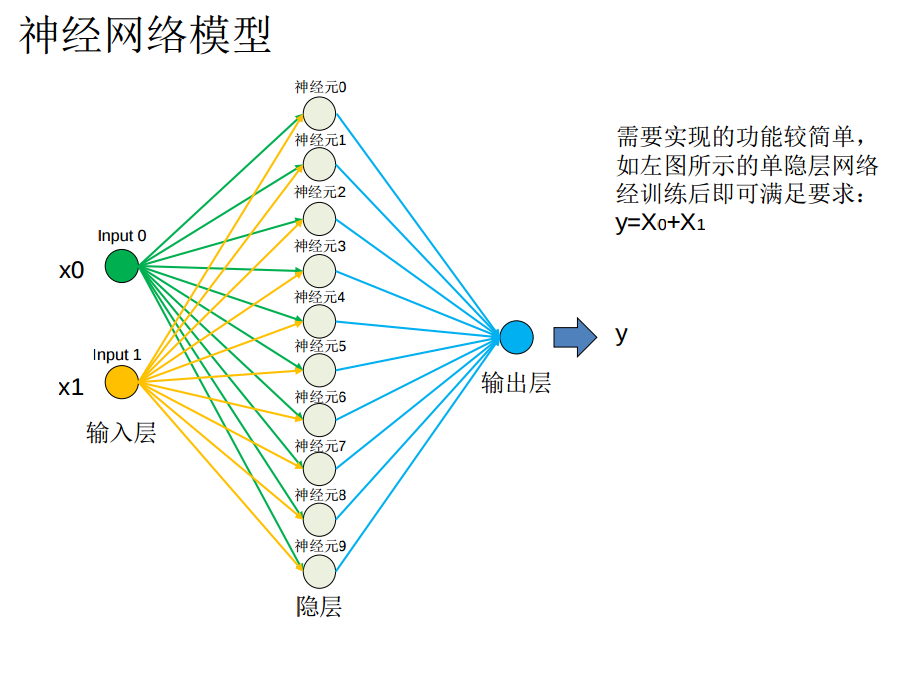
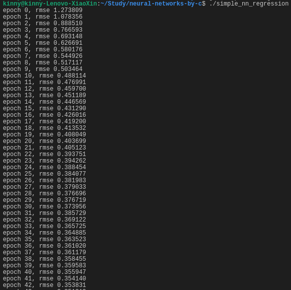
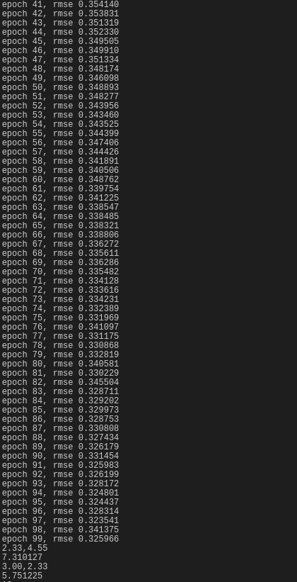
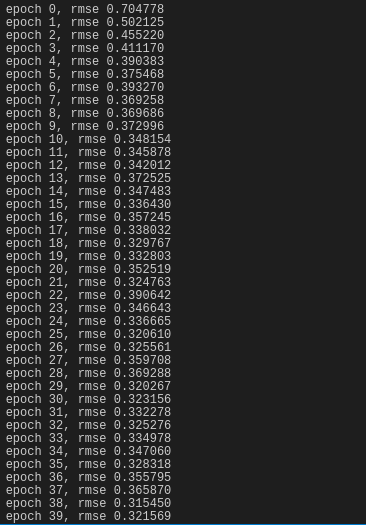
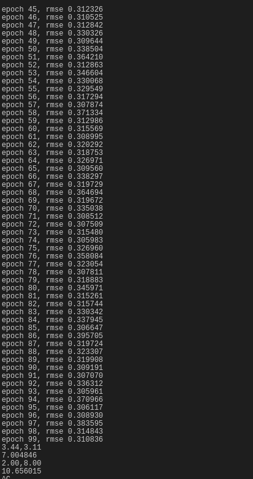
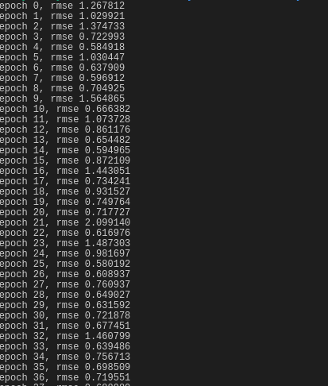

# neural-networks-by-c
a neural networks implemented by c from scratch

# tutorial
&emsp;&emsp;First you should unzip the .gz data files

## 目录结构
```
data: 训练用数据, 主要是mnist数据集
examples: 基于神经网络的例子程序
include: 头文件
src: 核心代码
test: 测试代码
resources: 相关资源文件
```

```
.
├── data
│   ├── test_images.txt
│   ├── test_images.txt.gz
│   ├── test_labels.txt
│   ├── test_labels.txt.gz
│   ├── train_images.txt
│   ├── train_images.txt.gz
│   ├── train_labels.txt
│   └── train_labels.txt.gz
├── examples
│   ├── adder
│   ├── adder.c
│   ├── mnist
│   ├── mnist.c
│   ├── nn_adder.c
│   ├── README.md
│   └── simple_nn_regression.c
├── include
│   ├── matrix.h
│   ├── mnist_reader.h
│   └── nn.h
├── README.md
├── report4.zip
├── resources
│   ├── nn.png
│   ├── 迭代1.png
│   ├── 迭代2.png
│   ├── 迭代3.png
│   ├── 迭代4.png
│   └── 迭代5.png
├── src
│   ├── matrix.c
│   ├── mnist_reader.c
│   ├── nn2.c
│   └── nn.c
└── test
    ├── Makefile
    ├── matrix.o
    ├── mnist_reader.o
    ├── README.md
    ├── test_matrix
    ├── test_matrix.c
    ├── test_reader
    └── test_reader.c

6 directories, 38 files
```

## 神经网络例子
`mnist.c` 是采用  `../src/nn.c` 构建的一个三层网络模型结构, 用来训练mnist数据集. 使用一下命令编译即可:
```
gcc -o mnist -I../include mnist.c ../src/nn.c ../src/mnist_reader.c ../src/matrix.c -lm
```


## 一个单隐层神经网络模拟加法器(回归模型)

## 模拟加法器
模拟两位 0~10 之间的双精度浮点数的加法器. 不使用第三方深度学习库, 本实验我采用的是标准C语言, 不使用任何第三方库!

### 网络模型
本实验采用的是单隐层神经网络模型! 如下图1所示:



图1.

模型公式:

$$
y = \sum_{j} v_jo_j
\qquad (1)
$$

$$
o_j = \sigma(\sum_{k} w_{j,k}x_k)
\qquad (2)
$$

$$
\sigma(z) = \frac{1}{1+e^{-z}}
\qquad (3)
$$

$$
\sigma^{'} = \sigma(1-\sigma)
\qquad (4)
$$

损失函数:

$$
L = \frac{1}{2}\sum_{j}^n (y_j - y^{'}_j)^2
\qquad (5)
$$

梯度公式:

$$
\frac{\partial L}{\partial v_j} = (y_j - y^{'}_j)o_j
\qquad (6)
$$

$$
\frac{\partial L}{\partial w_{j,k}} = \frac{\partial L}{\partial y_j}\frac{\partial y_j}{\partial o_j}\frac{\partial o_j}{\partial w_{j,k}} = (y_j - y^{'}_j)v_jo_j(1 - o_j)x_k
\qquad (7)
$$

更新公式:

$$
\delta_j = y_j - y^{'}_j
\qquad (8)
$$

$$
v_j = v_j - A * \delta_j * o_j
\qquad (9)
$$

$$
w_{j,k} =  w_{j,k} + A * o_j * (1 - o_j) * \delta_j * v_j * x_k
\qquad (10)
$$

这个简单模型采用 SGD 做参数更新训练, $k=0,1$ $j=0,1,\cdot9$.

### 实验代码
首先申明模型参数w,v,超参数A, 以及一个中间输出变量o.
```C
#define HIDDEN_SIZE 10
#define INPUT_SIZE 2
#define TRAINING_SIZE 10000
#define EPOCH 100

double w[HIDDEN_SIZE][INPUT_SIZE];
double v[HIDDEN_SIZE];
double A = 0.001;
double o[HIDDEN_SIZE];
```

然后是前向传播过程, 直接套用公式往前计算一遍即可:
```C
double forward(double x0, double x1) {
    double y = 0;
    for (int i=0; i<HIDDEN_SIZE; i++) {
        o[i] = sigmoid(x0 * w[i][0] + x1 * w[i][1]);
        y += o[i] * v[i];
    }
    // y = sigmoid(y);
    return y;
}
```
以下是反向传播过程, 采用我们的梯度更新公式 $(6)(7)$, 分别更新一次最后一层和前一层次的参数v和w. 这里是**随机梯度下降法SGD, 即每输入一个样例, 都更新一次权重. 好处是可以进行在线学习, 更新速度快,因为不像BGD需要使用所有数据才更新一次权重,缺点是伴随这噪声, 他不是每一次迭代都在往最优点接近, 因此可能跳过最优点.但是,整体趋势来讲, SGD是在往最优点接近的, 虽然有局部跳过的可能.**

下面是该模型的训练拟合过程, 我们迭代完所有的样本后, 将样本随机混洗, 然后再进行新一轮迭代, 轮数由参数 EPOCH 控制.每一轮完成之后,我们评估一下模型在训练集上的RMSE.
```C
double fit(double (*datas)[2], double *labels, int train_size) {
    int y;
    double rmse;
    int * array = (int*)malloc(sizeof(int) * train_size);
    
    for (int i = 0;  i < EPOCH; i++) {
        randomShuffle(array, train_size);
        // SGD
        for (int i = 0; i < train_size; i++) {
            y = forward(datas[array[i]][0], datas[array[i]][1]);
            backward(datas[array[i]][0], datas[array[i]][1], y, labels[array[i]]);
        }

        // 计算误差 RMSE
        for (int i = 0; i < train_size; i++) {
            y = forward(datas[i][0], datas[i][1]);
            rmse += (y - labels[i]) * (y - labels[i]);
        }
        rmse = sqrt(rmse/train_size);
        printf("epoch %d, rmse %lf\n", i, rmse);
    }
    
}
```
### 参数调整
重要的超参数就是学习率A, 然后还有 EPOCH. 我们设置 10000 个训练样列, A=0.001, EPOCH=100, 训练时的RMSE变化结果如下图2, 图3:



图2.



图3.

从结果可以看出, 学习率较小的时候, 学习速度还是比较慢的, RMSE 减小的比较慢, 因此为防止还没达到最优点就停止学习, EPOCH可以设置大一些, 即 A小, EPOCH就大.

再来看看我们将学习率A设置为A=0.005, 有什么变化:



图4.



图5.

从前几次的EPOCH来看, 学习还是很快的, 很快就到达最优点, 然后就开始在最优点附近徘徊了. **因此我们总结的经验就是, A与EPOCH 可以适当的成反相关设置, A大,EPOCH小,因为学习很快能到达最优点; A小, EPOCH大, 因为学习慢,需要多次迭代以免没有到达最优点. 但这个不是绝对的, A也不能太大,比如 A=0.1, 学习起来就非常没有规律, 一直在来回振荡一样. RMSE变化无常.**



图6.

### 注意点
我们需要对输入数据做归一化处理, 这样学习样本就是在同一个空间下.
```C
void norm(double (*datas)[2], double *labels, int train_size) {
    data0_min = data0_max = datas[0][0];
    data1_min = data1_max = datas[0][1];
    label_min = label_max = labels[0];
    for (int i = 1; i < train_size; i++) {
        if (datas[i][0] > data0_max) {
            data0_max = datas[i][0];
        }
        if (datas[i][0] < data0_min) {
            data0_min = datas[i][0];
        }

        if (datas[i][1] > data1_max) {
            data1_max = datas[i][1];
        }
        if (datas[i][1] < data1_min) {
            data1_max = datas[i][1];
        }
        
        if (labels[i] > label_max) {
            label_max = labels[i];
        }
        if (labels[i] < label_min) {
            label_min = labels[i];
        }
    }
    for (int i = 0; i < train_size; i++) {
        datas[i][0] = (datas[i][0] - data0_min + 1) / (data0_max - data0_min + 1);
        datas[i][1] = (datas[i][1] - data1_min + 1) / (data1_max - data1_min + 1);
        // labels[i] = (labels[i] - label_min + 1) / (label_max - label_min + 1);
        // printf("norm: %lf, %lf, %lf\n", datas[i][0], datas[i][1], labels[i]);
    }
}
```
### 附录
完整代码查看附件simple_nn_regression.c; 使用 `gcc simple_nn_regression.c -o simple_nn_regression -lm` 即可编译.